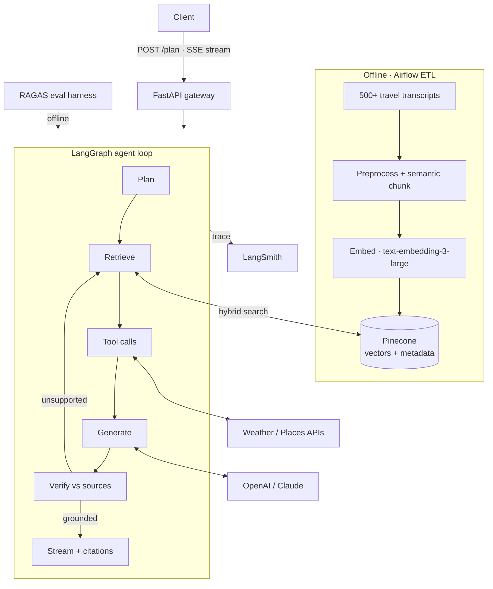

<div align="center">

# TripwiseAI

**An agentic RAG backend that generates travel itineraries grounded in retrieved sources — and measures that its answers stay grounded.**

[](https://www.python.org/)
[](https://fastapi.tiangolo.com/)
[](https://langchain-ai.github.io/langgraph/)
[](https://www.pinecone.io/)
[](https://airflow.apache.org/)

</div>

---

## Table of contents

- [Overview](#overview)
- [The problem](#the-problem)
- [Architecture](#architecture)
- [How it works](#how-it-works)
  - [The agentic loop](#the-agentic-loop)
  - [Hybrid retrieval](#hybrid-retrieval)
  - [Ingestion pipeline (Airflow ETL)](#ingestion-pipeline-airflow-etl)
- [Evaluation](#evaluation)
- [Grounding and verification](#grounding-and-verification)
- [Tech stack](#tech-stack)
- [Getting started](#getting-started)
- [Configuration](#configuration)
- [API reference](#api-reference)
- [Observability](#observability)
- [Deployment](#deployment)
- [Project structure](#project-structure)

---

## Overview

TripwiseAI turns a natural-language trip request ("5 relaxed days in Lisbon in summer,
mid-budget, into food and history") into a day-by-day itinerary. It is a
**retrieval-grounded, agentic** system: it retrieves relevant destination knowledge,
calls live tools for weather and places, generates the plan, and **verifies every
recommendation against its sources** before returning it — with citations.

The project is built around one goal:

> **Every recommendation in the itinerary is supported by a retrieved source — and
> that grounding is measured, not assumed.**

Retrieval quality and answer faithfulness are the hard problems; everything else is
the harness around them.

## The problem

The central failure mode of any LLM application is confident fabrication. For a travel
planner, a hallucinated restaurant or a museum that closed years ago quietly destroys
trust. Naïve RAG — embed, retrieve top-k, stuff into a prompt — helps but does not
solve it, for three reasons:

1. **Retrieval misses.** Pure vector search misses exact names and specific terms;
   pure keyword search misses paraphrase. Neither alone is enough.
2. **The model still drifts.** Even with good context, generation can assert claims the
   context does not support.
3. **Nobody measures it.** Most RAG systems have no objective signal for whether their
   answers are actually grounded.

TripwiseAI addresses all three: **hybrid retrieval with reranking** for recall and
precision, an **agent loop that self-verifies and revises** to catch drift, and a
**RAGAS evaluation harness** that turns "is it grounded?" into a number.

## Architecture

The system has an **offline** side that builds the knowledge index and an **online**
side that serves requests. The interesting engineering is in retrieval and grounding,
not in service topology — so the runtime is deliberately a single service.



**Roles at a glance:**

- **Ingestion (Airflow)** — an ETL DAG that preprocesses travel transcripts, chunks and
  embeds them, and upserts them to Pinecone with metadata. Runs offline, on a schedule.
- **Gateway (FastAPI)** — a `/plan` endpoint that validates the request and streams the
  agent's output back over Server-Sent Events.
- **Agent (LangGraph)** — the reasoning loop: plan → retrieve → call tools → generate →
  verify → (revise). One graph with a real cycle, not a fleet of agents.
- **Retrieval** — hybrid search (dense + lexical + rerank) over Pinecone with metadata
  filtering.
- **Evaluation (RAGAS)** — an offline harness that scores faithfulness and retrieval
  quality against a fixed query set.
- **Observability (LangSmith)** — traces every agent step with latency and token cost.

## How it works

### The agentic loop

The system is *agentic* in the meaningful sense: it reasons about what it needs, calls
tools, and loops based on the result — rather than running a fixed prompt chain. It is
a single LangGraph graph with a real cycle.

```
   Plan ──▶ Retrieve ──▶ Tools ──▶ Generate ──▶ Verify ─── grounded ──▶ Stream (with citations)
                ▲                                   │
                └────────── unsupported claim ──────┘   (bounded retries)
```

| Node       | Responsibility                                                              |
|------------|-----------------------------------------------------------------------------|
| **Plan**   | Parse the request into structured intent (city, dates, budget, interests)   |
| **Retrieve** | Hybrid search over Pinecone, metadata-filtered by city / season / budget  |
| **Tools**  | Call weather and places APIs for live data, when the plan requires them      |
| **Generate** | Produce the itinerary using *only* retrieved context and tool results     |
| **Verify** | Check each recommendation against its sources; flag unsupported claims       |
| **Revise** | On a failed check, re-retrieve / regenerate the weak part, then re-verify    |

The **generate → verify → revise** cycle is the core mechanism: the system does not
trust the model's first output. Unsupported claims trigger a bounded retry rather than
reaching the user, so hallucinations are caught before they ship.

### Hybrid retrieval

A query runs three metadata-filtered stages:

1. **Dense** — embedding similarity over Pinecone, for semantic matches.
2. **Lexical (BM25)** — keyword matches, for exact place names and specific terms.
3. **Rerank** — a cross-encoder reorders the merged candidates by true relevance.

Hybrid + rerank exists because dense and lexical retrieval fail in different ways, and
reranking corrects the ordering neither gets right alone. The measurable payoff of this
stage is the core [evaluation](#evaluation) result.

### Ingestion pipeline (Airflow ETL)

The knowledge index is built by an **Airflow DAG**, so ingestion is a scheduled,
retryable, observable pipeline rather than a one-off script.

```
preprocess ──▶ semantic chunk ──▶ embed (text-embedding-3-large) ──▶ upsert to Pinecone
```

- **Preprocess** — clean and normalize 500+ travel transcripts (deduplicate, strip
  boilerplate, normalize structure).
- **Chunk** — semantic chunking (split on meaning, not fixed token windows) so a
  coherent idea stays in one chunk, improving retrieval precision.
- **Embed** — `text-embedding-3-large` per chunk.
- **Index** — upsert to Pinecone with metadata (`city`, `season`, `budget`, `category`,
  `source_id`) used for filtered retrieval and citation back-references.

Each stage is an Airflow task with retries and logging, so a failure in embedding or
upsert is isolated and re-runnable without reprocessing the whole corpus.

## Evaluation

Most RAG projects cannot answer *"is it actually grounded?"* — this one can, because
answer quality is measured, not assumed. Evaluation is an offline harness
([`eval/`](eval/)) run against a fixed set of representative trip queries.

**Metrics (RAGAS):**

| Metric            | Question it answers                                          |
|-------------------|-------------------------------------------------------------|
| Faithfulness      | Is every generated claim supported by the retrieved context? |
| Answer relevancy  | Does the itinerary actually address the request?            |
| Context precision | Is the retrieved context on-topic rather than noisy?         |
| Context recall    | Did retrieval surface the context needed to answer?          |

**Method.** Run the pipeline over the query set and score it **before and after adding
reranking**, so the improvement is attributable to a specific change.

| Configuration            | Faithfulness | Context precision |
|--------------------------|--------------|-------------------|
| Dense-only baseline      | `<fill>`     | `<fill>`          |
| Hybrid + cross-encoder rerank | `<fill>` | `<fill>`          |

> Reproduce with `make eval`. Fill the table with your measured RAGAS scores — the
> before/after delta is the point, not the absolute numbers.

## Grounding and verification

Two independent mechanisms enforce grounding:

- **Constrained generation** — the generate step is instructed to use only retrieved
  context and tool results and to attach a `source_id` to each item.
- **Enforced verification** — the verify step re-checks each item against its source and
  triggers the revise loop on unsupported claims.

The streamed response carries per-recommendation citations, so grounding is inspectable
by the client rather than merely internal. When the system cannot ground a claim, it
declines to assert it rather than inventing it.

## Tech stack

| Layer          | Technology                                        |
|----------------|---------------------------------------------------|
| Language       | Python 3.11                                        |
| API            | FastAPI (async, SSE streaming)                     |
| Agent          | LangGraph                                          |
| Vector store   | Pinecone                                           |
| Embeddings     | OpenAI `text-embedding-3-large`                    |
| LLM            | OpenAI / Claude (swappable behind a provider interface) |
| Retrieval      | Dense + BM25 + cross-encoder reranking             |
| Ingestion      | Apache Airflow (ETL DAG)                            |
| Evaluation     | RAGAS                                              |
| Observability  | LangSmith (traces, latency, token cost)            |
| Deployment     | Docker → GCP Cloud Run                              |

## Getting started

### Prerequisites

- Python 3.11+
- Docker and Docker Compose
- API keys: OpenAI, Pinecone (and weather / places providers)

### Run locally

```bash
git clone https://github.com/<you>/tripwise-ai.git
cd tripwise-ai

cp .env.example .env        # add your API keys
make up                     # start the API (and dependencies) via Docker Compose
```

The API starts on `http://localhost:8000`.

### Build the index

```bash
make ingest                 # run the Airflow ingestion DAG against sample transcripts
```

### Run the evaluation

```bash
make eval                   # score the pipeline with RAGAS and print the report
```

### Common make targets

```bash
make up        # start the API stack
make down      # stop it
make ingest    # run the Airflow ingestion pipeline
make eval      # run the RAGAS evaluation harness
make test      # run unit tests
```

## Configuration

Configuration is via environment variables (see `.env.example`):

| Variable              | Description                                | Default   |
|-----------------------|--------------------------------------------|-----------|
| `OPENAI_API_KEY`      | OpenAI key (LLM + embeddings)              | —         |
| `PINECONE_API_KEY`    | Pinecone key                               | —         |
| `PINECONE_INDEX`      | Index name                                 | `tripwise`|
| `LLM_PROVIDER`        | `openai` or `anthropic`                    | `openai`  |
| `EMBED_MODEL`         | Embedding model                            | `text-embedding-3-large` |
| `RETRIEVE_TOP_K`      | Candidates retrieved before reranking      | `20`      |
| `RERANK_TOP_N`        | Chunks kept after reranking                | `5`       |
| `MAX_VERIFY_LOOPS`    | Max revise iterations before returning     | `2`       |
| `LANGSMITH_API_KEY`   | LangSmith key (tracing)                    | —         |

## API reference

### `POST /plan`

Generates an itinerary and streams the response over Server-Sent Events.

```http
POST /plan
Content-Type: application/json

{
  "query": "5 relaxed days in Lisbon in summer, mid-budget, food and history",
  "days": 5
}
```

The response streams incrementally; the final payload includes per-item citations:

```json
{
  "day": 1,
  "items": [
    {
      "title": "Time Out Market",
      "type": "food",
      "citations": ["guide_lisbon_3", "poi_lisbon_food_11"]
    }
  ]
}
```

Any SSE-capable client (web frontend, CLI, notebook) can consume the stream.

## Observability

- **LangSmith** traces every agent step — plan, retrieval, tool calls, generation,
  verification — with per-step latency and token cost, so slow or expensive steps are
  visible and the revise loop is debuggable.
- Token cost per request is tracked to keep generation efficient.

## Deployment

The service is containerized with **Docker** and deployed to **GCP Cloud Run** — a
stateless, request-driven API that scales to zero when idle and scales out under load,
which is the right fit for this workload without cluster overhead.

```
Docker image ──▶ GCP Cloud Run (autoscaling, scale-to-zero)
Airflow DAG ──▶ scheduled ingestion into Pinecone
```

Secrets (API keys) are injected at runtime via the platform secret manager, never baked
into the image.

## Project structure

```
/app
  main.py                  # FastAPI, /plan endpoint, SSE streaming
  /agent
    graph.py               # LangGraph loop: plan/retrieve/tools/generate/verify/revise
    nodes.py               # node implementations
  /rag
    retrieve.py            # hybrid retrieval: dense + BM25 + rerank, metadata filter
  /tools
    weather.py             # weather tool
    places.py              # places tool
  /llm
    provider.py            # OpenAI / Claude interface (swappable)
/airflow
  /dags
    ingest_dag.py          # preprocess → chunk → embed → upsert to Pinecone
/eval
  ragas_eval.py            # offline RAGAS harness
  queries.jsonl            # representative trip queries
/deploy
  Dockerfile
```
